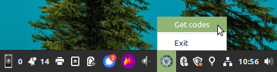
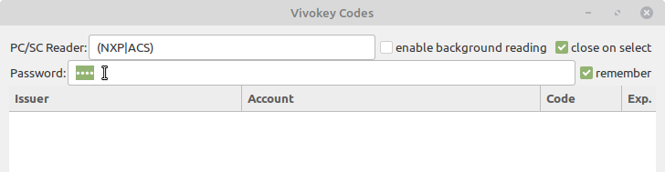
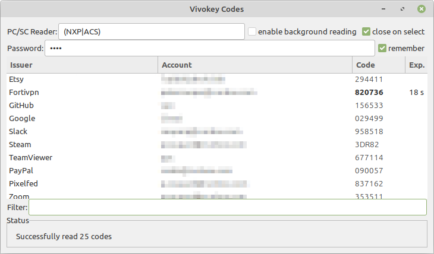
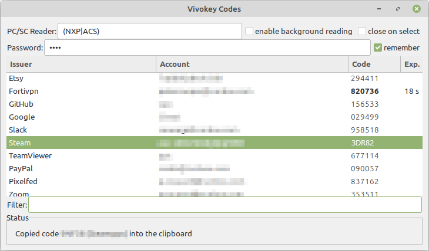

# Vivokey Codes
### Version 0.6.3

GTK authenticator to read TOTP codes from a Vivokey or Yubikey OTP applet,
display them and copy them into the clipboard.


## Installation

### Manual installation

Clone this repository then install the files as root:

```
install -m 755 vivokey_codes.py /usr/bin/vivokey_codes
install -m 644 vivokey_codes.png /usr/share/icons/
install -m 644 vivokey_codes.desktop /etc/xdg/autostart/
install -m 644 vivokey_codes.desktop /usr/share/applications/
```

### DEB package


See https://github.com/Giraut/ppa to add the PPA repository to your APT sources, then:

```
sudo apt install vivokey-codes
```


## Usage

Go into your startup programs configuration and enable Vivokey Codes. Then log out and back in, or start the program immediately if your startup configuration allows it.

This program starts minimized in the system tray. Click on the icon then select "Get codes", or middle-click on the icon, to start the authenticator's panel.



As soon as the panel comes up, it starts polling the PC/SC reader whose name is specified in the PC/SC Reader field (or matches the regular expression in that field) for a Vivokey or Yubikey NFC token to read. When the panel is closed, it stops polling the reader.

Present your Vivokey or Yubikey NFC token to the reader. If the token is passworded, you can set the password in the panel.



If a token is read successfully, the accounts and associated TOTP codes it returned are displayed in the list. If an account is a Steam account (i.e. the issuer is "Steam"), the TOTP code will be a 5-letter Steam code.



Select one entry to copy the code into the clipboard. The code may be pasted into any application with right-click-paste, Ctrl-V or with the middle-click.



If background reading is enabled, the authenticator's panel automatically appears upon successfully reading new codes.

If close on select is enabled, the authenticator's panel automatically closes when a code is selected.
